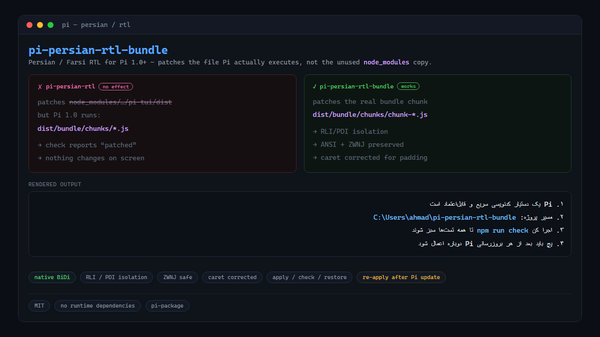

# pi-persian-rtl-bundle

[](https://github.com/cinorid/pi-persian-rtl-bundle/actions/workflows/ci.yml)
[](https://www.npmjs.com/package/pi-persian-rtl-bundle)
[](./LICENSE)



Persian/Farsi RTL support for **Pi 1.0+** that patches the file Pi *actually
executes*.

This is a working replacement for [`pi-persian-rtl`](https://pi.dev/packages/pi-persian-rtl)
v0.1.1, which patches `node_modules/@earendil-works/pi-tui/dist` — a file Pi 1.0
never loads. See [REPORT-UPSTREAM.md](./REPORT-UPSTREAM.md) for the full
diagnosis.

## Why this exists

Pi 1.0.0 ships a self-contained Bun bundle:

```
bin  ->  <pkg>/dist/bundle/cli.js
         -> dist/bundle/cli-runtime.js
         -> dist/bundle/chunks/*.js
```

All of `@earendil-works/pi-tui` is **inlined** into one chunk
(`chunk-*.js`, the one exporting `TuiMainScreen`, `Editor`, `visibleWidth`, …),
and nothing under `dist/bundle/` imports `@earendil-works/pi-tui` from
`node_modules`.

So a patch against `node_modules/@earendil-works/pi-tui/dist` is dead code. It
applies cleanly, the file on disk really does change, and Pi's behaviour does
not change at all. `pi-persian-rtl check` even reports `patched: ...`, because
it inspects the file it patched rather than the file Pi runs.

This package patches the bundled chunk instead.

## Install

```sh
npm install -g pi-persian-rtl-bundle      # or run it via npx
npx pi-persian-rtl-bundle doctor
npx pi-persian-rtl-bundle apply
```

Or install it as a Pi package, which also registers the extension that
re-applies the patch at startup:

```sh
pi install npm:pi-persian-rtl-bundle
```

Either way, **restart Pi** — the patch rewrites the bundle on disk, so it only
takes effect in a new process.

## Commands

```
pi-persian-rtl-bundle apply      Patch the files Pi actually runs (idempotent)
pi-persian-rtl-bundle check      Report whether the LIVE runtime path is patched
pi-persian-rtl-bundle restore    Undo the patch (in place)
pi-persian-rtl-bundle doctor     Show every discovered target
```

Useful flags: `--json`, `--force` (restore from backup), `--bundle-dir PATH`,
`--tui-dist PATH`.

`apply` writes a one-time backup next to the patched file:

```
chunk-2KTBZM5G.js.pi-persian-rtl-bundle.bak
```

`restore` reverses the patch **in place** using exact reverse swaps, so it does
not clobber a newer Pi build. It only falls back to the backup with `--force`.

## Modes

| Env var | Values | Default | Effect |
|---|---|---|---|
| `PI_PERSIAN_RTL_MODE` | `native` \| `visual` \| `off` | **auto-detected** | See below. |
| `PI_PERSIAN_RTL_ALIGN` | `right` \| `left` | `right` | Right-align Persian-first lines. `left` adds no padding. |
| `PI_PERSIAN_RTL_CARET` | `on` \| `off` | `on` | Correct the caret column for padding + RTL mirroring. |
| `PI_PERSIAN_RTL_TERMINAL_BIDI` | `true` \| `false` | unset | Force the terminal-capability probe for auto mode. |

### Which mode do I need?

This is the part that bites everyone, so it is detected rather than assumed.

| Mode | Use when | Renders |
|---|---|---|
| `native` | The terminal implements the Unicode Bidirectional Algorithm | logical order + RLI/PDI isolation; the terminal reorders |
| `visual` | The terminal does **not** implement BiDi | application-side reorder, colour preserved |
| `off` | You want pi to leave output alone | unchanged |

Getting this wrong is visible either way: `native` on a BiDi-less terminal shows
the text **reversed**, and `visual` on a BiDi-capable terminal **double-reverses**
it.

**Auto-detection.** With no explicit `PI_PERSIAN_RTL_MODE`, the mode is chosen
from the terminal:

* `WT_SESSION` / `WT_PROFILE_ID` set (Windows Terminal), or `process.platform === "win32"` → **`visual`**
* everything else → **`native`**

Windows Terminal does not implement BiDi — [microsoft/terminal#538](https://github.com/microsoft/terminal/issues/538)
has been open in the Backlog since 2019 — and neither does conhost, so on
Windows `native` would leave text reversed. Override the probe with
`PI_PERSIAN_RTL_TERMINAL_BIDI=true|false`, or just set the mode explicitly.

### Native mode

* keeps text in logical Unicode order — never reverses it;
* wraps RTL-first lines in RLI/PDI (`U+2067`/`U+2069`) so mixed
  Persian/English/URLs/code stay stable;
* preserves ANSI colors and styles;
* keeps ZWNJ and Persian digits intact;
* right-aligns Persian-first lines.

### Visual mode

* reorders graphemes in-process so a BiDi-less terminal shows correct RTL;
* **preserves ANSI colour** by carrying the escape state with each grapheme;
* is an approximation for mixed lines: Latin runs stay intact, Persian runs are
  reversed, but a line interleaving both can still be imperfect.

## The caret and alignment problem

Pi's render order is:

```
render()  ->  renderLayoutFrame()  ->  extractCursorPosition()  ->  applyLineResets()
```

Two consequences, both handled here:

**1. The line is already full width.** Pi's layout frame
(`renderLayoutFrame` → `paintBox`) pads every line out to the terminal width
*before* `applyLineResets` runs. A naive `columns - visibleWidth(line)` padding
is therefore always `0`, which is why a first attempt at this produced no
right-alignment at all. The trailing padding is **relocated** to the front
rather than added, so a bare line and a frame-padded line produce identical
output.

**2. The caret is computed before padding is applied.** So padding shifts the
text out from under the caret. Additionally, an RTL paragraph mirrors glyph
order, so a logical caret at index `k` lands at visual column `total - k`:

```
logical 0 (before the first char) -> right edge of the content
logical n (after the last char)   -> left edge of the content
```

`extractCursorPosition()` is patched too, so the caret is computed as
`pad + (total - logical)` for RTL-first lines. Set `PI_PERSIAN_RTL_CARET=off` if
your terminal disagrees, or `PI_PERSIAN_RTL_ALIGN=left` to remove padding
entirely.

This is an approximation: terminals do not expose their BiDi layout, so lines
mixing Persian with Latin words can still place the caret imperfectly.

## Text selection

Dragging over Persian text highlights the characters you dragged over, not a
mirrored copy of them.

Pi applies the selection highlight in `applySelection()` **before**
`applyLineResets()` reorders the line. The highlight therefore landed on the
logical characters at the dragged screen columns, and the reorder then carried
those characters to the opposite side — the highlight appeared mirrored.

Because the reordered line is exactly the mirror of the logical line, the column
mapping inverts as `lineWidth - 1 - col`. Only the highlight call site is
patched: the copy path (`getActiveSelectionText()`) reads `previousScreen`, which
already holds the reordered lines, so its raw column mapping is correct and
mirroring it again would break copying.

## Compatibility

| Pi version | Runtime layout | Status |
|---|---|---|
| 1.0+ | `dist/bundle/chunks/*.js` | primary, tested |
| < 1.0 | `@earendil-works/pi-tui/dist` | best-effort, only used when no bundle is found |

The legacy path is only touched when no runtime bundle exists, so it cannot
conflict with `pi-persian-rtl` on a modern install.

## Development

```sh
npm test     # 39 tests, including a probe that loads the real patched chunk
npm run check
```

The integration tests read your actual installed Pi bundle and will **skip**
cleanly if no Pi install is present. One test writes a temporary probe file
beside the real chunks (so relative imports resolve) and deletes it in a
`finally` block.

## Notes

* Patching Pi's own bundle is inherently fragile: a Pi update replaces the
  chunk and the patch must be re-applied. `check` tells you the current state.
* After a Pi update, re-run `apply`.
* Removing `pi-persian-rtl` is recommended — it patches an unused file and its
  `check` command is misleading. It is harmless to leave installed.

## License

MIT — see [LICENSE](./LICENSE) and [NOTICE](./NOTICE).

This project is not affiliated with Pi or with `pi-persian-rtl`. It patches
another program's bundle, which is inherently unsupported. See
[CONTRIBUTING.md](./CONTRIBUTING.md) before sending patch changes.
